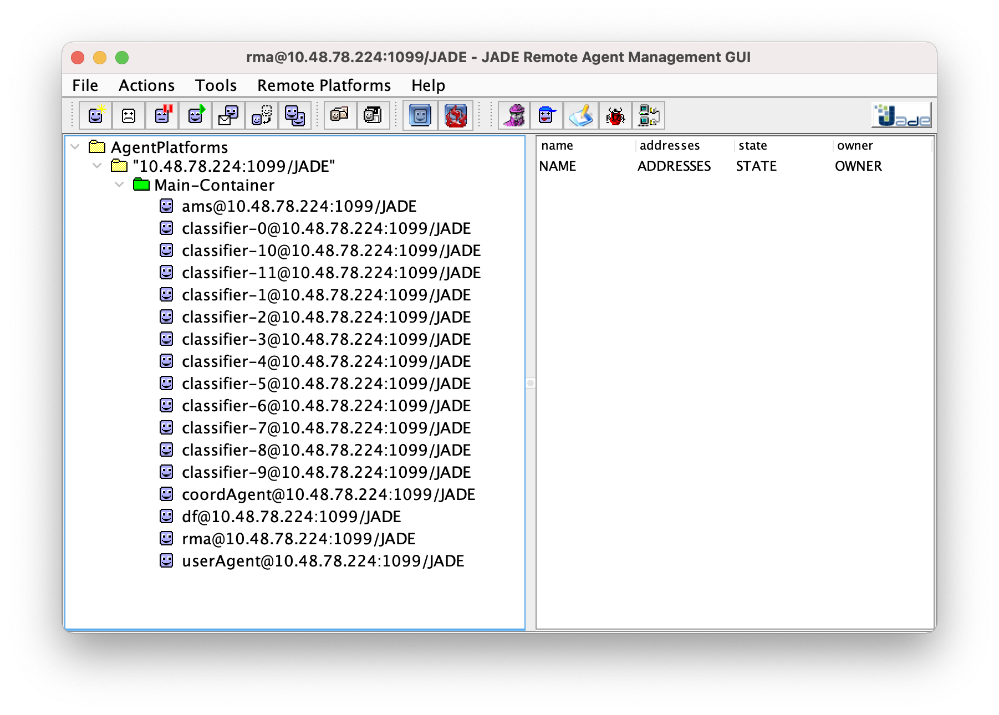
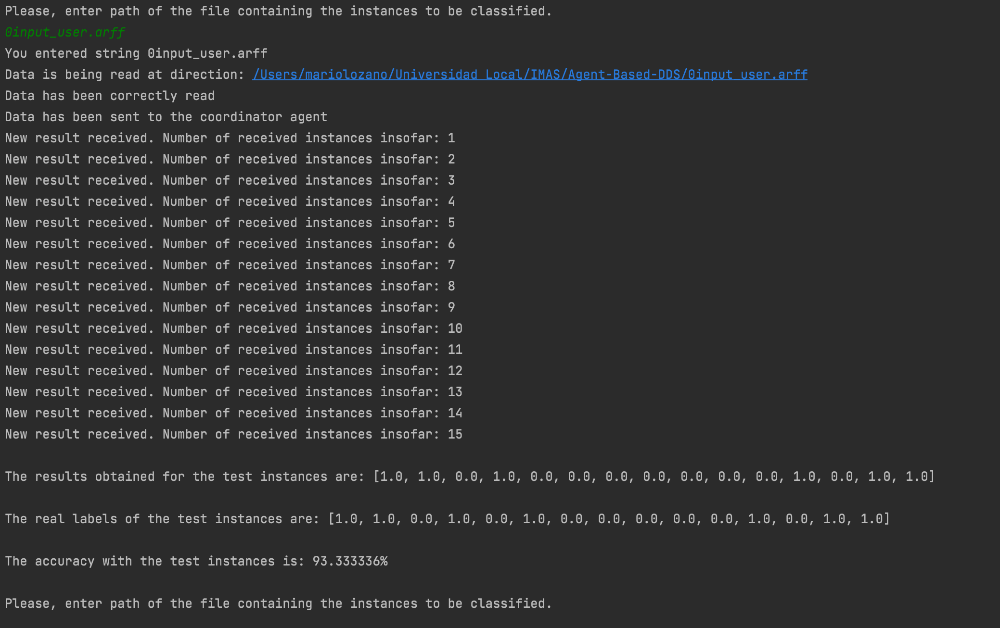

# Agent-Based-DSS 🤖 🗳
Agent-Based-DDS design for the Introduction to Multi-Agent Systems subject at Universitat Rovira i Virgili. This project was co-author by [Sergi Cirera Rocosa](https://github.com/Sergi-Cirera-Rocosa), [Laia Borrell Araunabeña ](https://github.com/Laiaborrell), [Mario Lozano Cortés](https://github.com/SrLozano) and [Iago Águila Cifuentes ](https://github.com/iAguila98). Artificial Intelligence master's students at _Universitat Politècnica de Catalunya · BarcelonaTech - UPC_.

# Goal of the project 💥💯
The goal of this project is to create an agent-based decision support system (A-DSS) for detecting fraudulent firms. It aims to properly coordinate a set of agents to form an application where an organization could enter a set of data about a given firm and the system returned an accurate classification stating whether the firm has risk of fraudulence or not. All the code is written in **Java**, **Maven** has been used as build automation tool, **JADE** (Java Agent DEvelopment Framework) as a platform for agent development and **Weka** for its collection of machine learning algorithms.

## Run it - Maven Goals 🚀

Once downloaded the system can be run in the following way thanks to the **maven goal** defined:

But first we need to compile the project with the following maven task:
```sh
mvn install
```
Execute complete system with integrated gui:
```sh
mvn -P systemAgents exec:java
```

This last maven goal is going to wake up both the user and coordinator agents. The following agents and the complete system is going to be initiated from those agents (please check code and report).

## Usage 🎮
After executing the code the user agent asks/allows the human user of the system to enter a path corresponding to a file containing the firms to classify. Whenever it receives a path, the user reads the dataset, and it sends the input instances to the coordinator who will receive those instances and iterate over each of them checking which attributes they contain, and which are missing. Then, it checks which classifiers have been trained with six attributes that are present in the instance available information and are sent the corresponding instance by the coordinator. When an instance arrives to the corresponding classifiers, they used their trained J48 model to classify the new firm and sent their estimation back to the coordinator. Followingly, the coordinator agent waits for the active classifiers’ responses and when it has gathered them all, it performs a weighted mean with each classifier vote/result (which will be 0 if no risk or 1 if risk exists). Finally, when the user agent keeps receiving the results, it iteratively stores and show them on the console.

## For developers 💻
In this section we will put the extra commands and tasks that people who want to collaborate in the project will have to perform. For example, installation of programs, packages, dependencies ...


## Next updates 🔜
There are no updates programmed. The project has already been delivered.

## Issues 🤕
No issues found so far.

## Want to collaborate? 🙋🏻
Feel free to improve and optimize the existing code. To contribute to the project, read the previous points carefully and do the next steps with the project:
1. Fork it (<https://github.com/SrLozano/Agent-Based-DDS/fork>)
2. Create your feature branch (`git checkout -b feature/fooBar`)
3. Commit your changes (`git commit -am 'Add some fooBar'`)
4. Push to the branch (`git push origin feature/fooBar`)
5. Create a new Pull Request

## Need help ❓
Feel free to contact the developers if you have any questions or suggestions about the project or how you can help with it.

## Screenshots 📸
Some screenshots of the project working:






